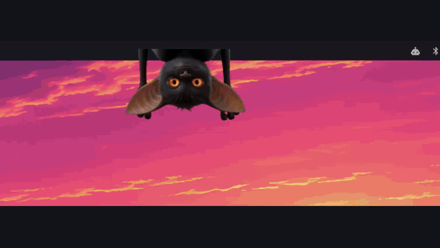

# Gremlins

**A boot bumper for Omarchy Quattro.** Gremlins haul pixel crumbs out of the dark,
one of them screams **OMACHEE**, and then they're gone — three seconds, once, and your
desktop is yours.

> The R is silent. That's the joke, and also the point.



```bash
omarchy plugin add https://github.com/mrjamesmyers/omarchy-gremlins.git --enable
```

Omarchy will show you the repo and ask you to confirm — plugins run unsandboxed inside the
shell process, so read the source before you enable anything, including this.

---

## What it does

- **Plays once on login, on every screen.** Not a loop, not a screensaver. Three seconds, then nothing.
- **Comes with matching wallpapers.** The bumper flashes to white and hands you back your
  desktop. Two companion backgrounds from the same world ship alongside it — gremlins
  wandering off with your pixels — so the desktop can read as the continuation of the
  animation. **You install them; the plugin never touches your wallpaper on its own.**
- **Something lives behind your bar.** Every minute or two it hooks its head over the edge,
  watches for a few seconds, ducks, glances around, and drops out of sight. Hover and it
  notices you. Click to replay the bumper — and it leaves, because it's on your screen now.
  It's a cut-out, so it reads correctly on a dark bar, a light theme, or a transparent bar
  over a busy wallpaper.
- **Loops only if you ask.** There's a setting. It's off by default, and it should be.

## Why it's shaped like this

DHH, on the 19th, thinking out loud about putting video into Omarchy:

> "I'm thinking one-off on boot by default. Then if you want something that runs all the
> time, you select that yourself."

And Jason Fried, in the same thread:

> "Constraint should be 3 seconds max, something like that. Like a Netflix bumper."

So: three seconds, one-off on boot, looping is opt-in. This plugin is an attempt at the
shape they were describing. The last-frame-becomes-the-background idea came from
[@rootkid](https://x.com/rootkid) and [@mehieltwit](https://x.com/mehieltwit) in the same
replies.

## Requirements

`qt6-multimedia` with the FFmpeg backend — both already present on Omarchy Quattro, so
there is nothing to install. No sudo, no install hooks, no third-party repos.

The bumper ships as **H.264 mp4**, not animated WebP. Omarchy's Qt has no WebP image
plugin at all (`/usr/lib/qt6/plugins/imageformats/` is gif/ico/jpeg/pdf/svg), so
`AnimatedImage` cannot decode WebP here — but `qt6-multimedia-ffmpeg` plays mp4 happily,
and mp4 carries its own audio track, so the scream needs no separate player.

## Cost

Measured on the shell process (Omarchy 4.0.0, Ryzen mini PC, 1920x1080 + 3840x2160):

| State | Shell CPU |
|---|---|
| Idle | **0.0%** |
| Bumper playing | ~5% for three seconds |
| Loop mode running | **4.9%** |
| Bar widget, idle | **0.05%** |
| After it finishes / after `hide` | **0.0%** |

Back to a flat zero is the number that matters: the overlay tears its own layer surface
down when playback ends, so afterwards there is no surface, no decoder, and nothing doing
work. Loop mode costs that 4.9% for as long as you leave it on — which is why it's off by
default.

## Settings

Inline on the plugin entry in `~/.config/omarchy/shell.json`:

| Setting | Default | What it does |
|---|---|---|
| `source` | shipped bumper | Path to your own video file |
| `playOnLogin` | `true` | Play once when the shell starts |
| `loop` | `false` | Keep playing forever. Costs GPU. Off for a reason. |
| `sound` | `true` | The scream |
| `peekMinSeconds` | `45` | Shortest gap between appearances |
| `peekMaxSeconds` | `120` | Longest gap between appearances |

**Bring your own bumper.** Point `source` at any video file. The gremlins are the default,
not the product — the product is the shape.

## Loop mode — the live wallpaper

DHH, on the same thread: *"if you want something that runs all the time, you select that
yourself."* So it's opt-in, and it isn't the bumper on repeat — that would be a gremlin
screaming at you every three seconds. It's a separate ambient loop: the same two gremlins
wandering a dark field hauling crumbs, seamless, silent, 343 KB.

```bash
omarchy-shell shell summon io.github.mrjamesmyers.gremlins '{"source":"file:///home/YOU/.config/omarchy/plugins/io.github.mrjamesmyers.gremlins/assets/loop.mp4","loop":true,"sound":false}'
```

Dismiss it with `omarchy-shell shell hide io.github.mrjamesmyers.gremlins`, `Esc`, or a click.

**This costs GPU for as long as it runs.** It's encoded cheaply — 24 fps, CRF 27, no audio —
because it's dark and slow and compresses well, but a loop is still a loop. On a laptop on
battery, don't.

## The wallpapers

Two backgrounds ship in `assets/`, built to stay out of your way: near-black, wide open
through the centre, with the gremlins small in one corner.

```bash
omarchy-theme-bg-set ~/.config/omarchy/plugins/io.github.mrjamesmyers.gremlins/assets/wallpaper-cool.jpg
```

Swap `cool` for `warm` if you prefer the warmer grade. To keep them in your theme's
rotation instead, drop them in `~/.config/omarchy/backgrounds/<your-theme>/`.

## Known limits

- Tested on Omarchy 4.0.0 with a 1920x1080 + 3840x2160 pair.
- Every output gets its own decoder, so CPU scales with monitor count (~5% each, for three
  seconds). Fine at two or three screens; silly at eight.

## Non-goals

- Not a screensaver, not a video player, not a wallpaper manager.
- No sudo, no install hooks, no system modification. It's QML and two asset files.
- It will not make your laptop battery happy if you turn loop mode on. Don't.

## Made with AI

The gremlins, the bumper, and the wallpaper are AI-generated and hand-cut. Saying so up
front because DHH labels his own that way and you deserve to know what you're installing.
The QML is hand-written.

## Credits

Built by [James Myers](https://github.com/mrjamesmyers). MIT licensed.

Not affiliated with, sponsored by, or endorsed by Omarchy, the Omacom Foundation, or
37signals.
